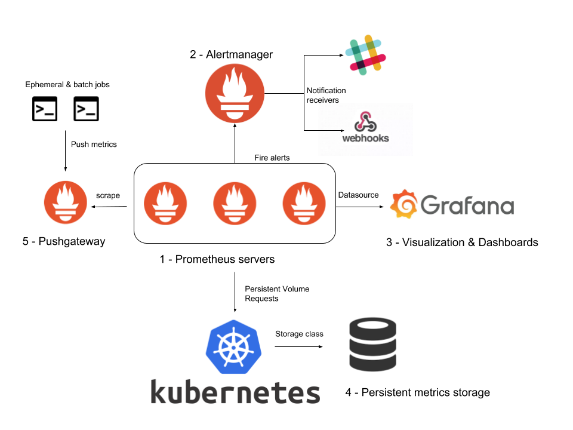
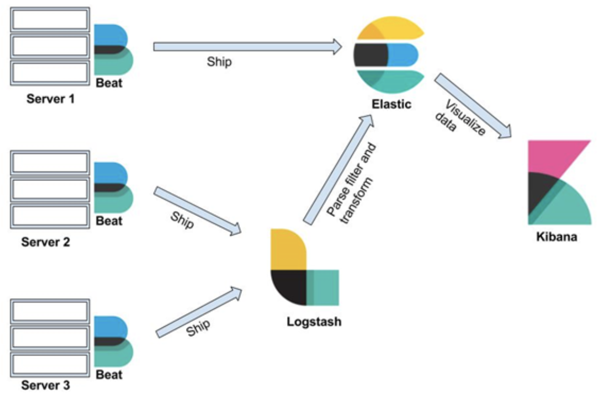
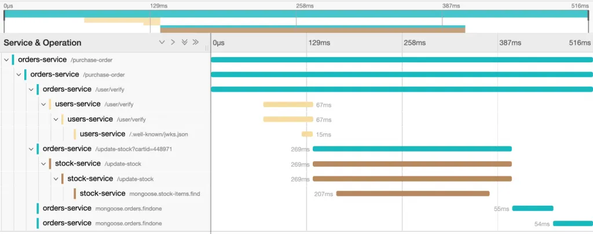

# transparent it operations

---

## whoami

* Dominik Aschbacher
* 22 y/o
* DevOps Engineer @ BearingPoint

---

## agenda

* the problem
* the solution
* monitoring & observability

---

## the problem

changes are made without anyone knowing

---

## the old / manual way

everything is deployed manually

---

## the semi-automated way

* configuration in git
* custom deploy scripts
* ansible executed locally

---

## the solution

---

## ci/cd & gitops

* iac / cac
* rollout via ci/cd
* or controlled via agent

---

## installing fluxcd

```bash
flux bootstrap github \
  --owner=aschbacd \
  --repository=linuxtage \
  --branch=main \
  --path=./flux/clusters/minikube \
  --personal \
  --token-auth
```

---

## demo

---

## monitoring & observability

---

## monitoring & alerting

* prometheus (exporters)
* alertmanager
* checkmk

---

<!--_backgroundColor: white-->



---

## logging

* elasticsearch

---

<!--_backgroundColor: white-->



---

## tracing

* opentracing (jaeger)
* dynatrace

---

<!--_backgroundColor: white-->



---

## sum

* use git / iac
* create useful alerts
* collect logs centrally

---

## questions?
